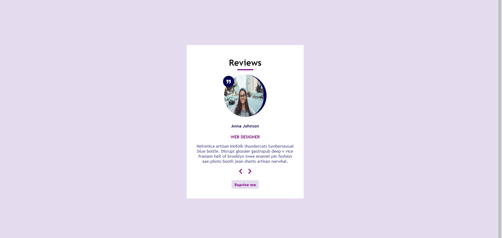

## Description

Mock data is used in the project. Data can be changed using the next and back button.
Additionally, random data can be taken.

[Live]()

In the project directory, you can run:

### `npm install`  
### `npm start`

## Technologies 
* React.js
* Hook (useState)
* Conditional Rendering
  

